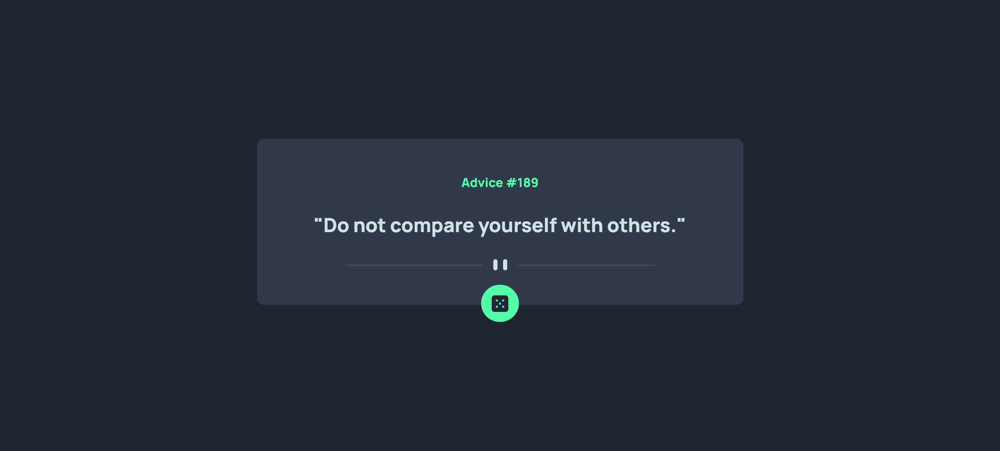
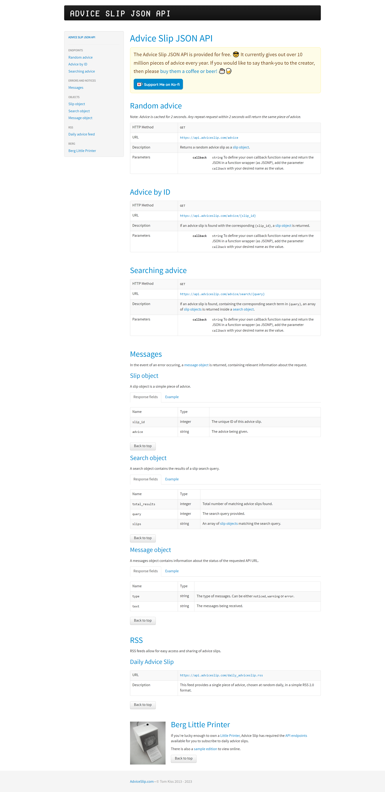
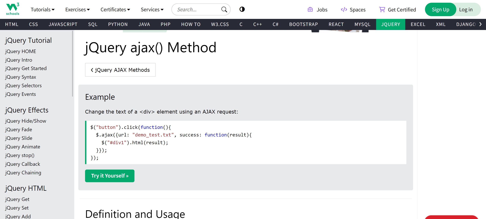

# Frontend Mentor - Advice generator app solution

This is a solution to the [Advice generator app challenge on Frontend Mentor](https://www.frontendmentor.io/challenges/advice-generator-app-QdUG-13db). Frontend Mentor challenges help you improve your coding skills by building realistic projects.

## Table of contents

- [Overview](#overview)
  - [The challenge](#the-challenge)
  - [Screenshot](#screenshot)
  - [Links](#links)
- [My process](#my-process)
  - [Built with](#built-with)
  - [Useful resources](#useful-resources)
- [Author](#author)

## Overview

### The challenge

Users should be able to:

- View the optimal layout for the app depending on their device's screen size
- See hover states for all interactive elements on the page
- Generate a new piece of advice by clicking the dice icon

### Screenshot

### Links

- Solution URL: (https://www.frontendmentor.io/solutions/responsive-advice-generator-app-bf4jq9TGO5)
- Live Site URL: (https://arkam-mohamad.github.io/advice-generator/)

## My process

### Built with

- Semantic HTML5 markup
- CSS custom properties
- Flexbox
- JavaScript
- Mobile-first workflow
- [jQuery](https://jquery.com/) - JS library

### Useful resources

- [Advice Slip JSON API](https://api.adviceslip.com/) - This helped me to get advice quotes.

- [jQuery ajax() Method](https://www.w3schools.com/jquery/ajax_ajax.asp) - This helped me to use server requests.

## Author

- Frontend Mentor - [@arkam-mohamad](https://www.frontendmentor.io/profile/arkam-mohamad)
